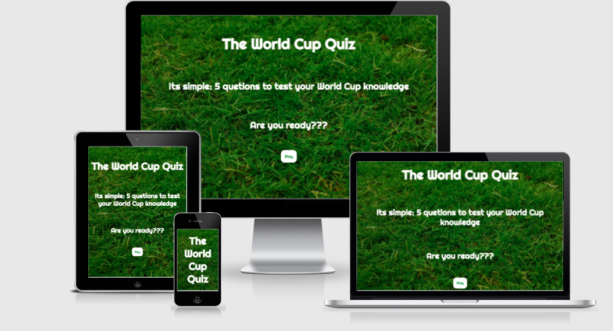
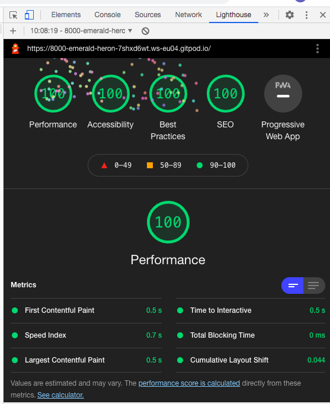
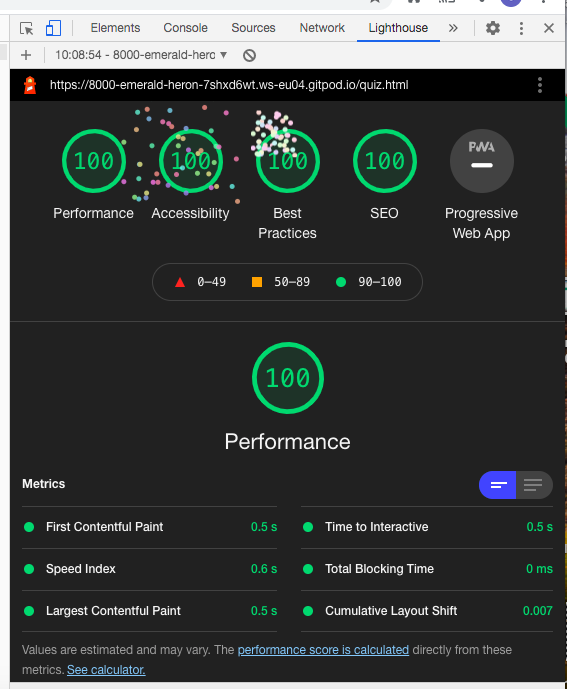
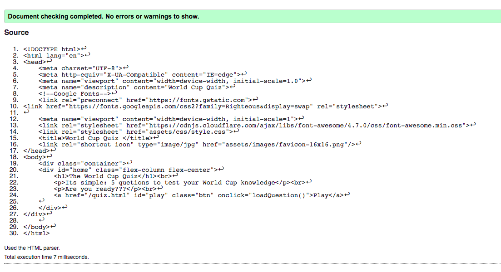
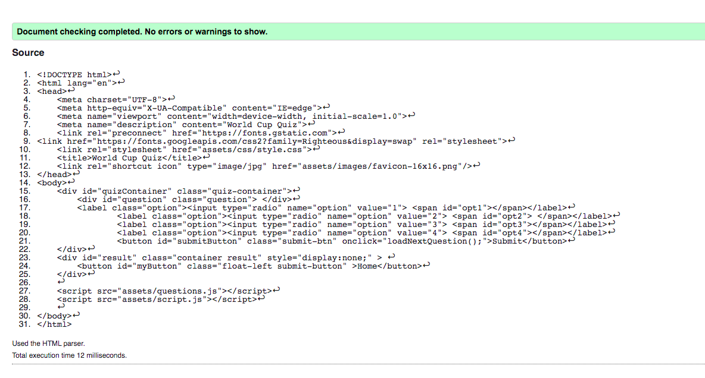
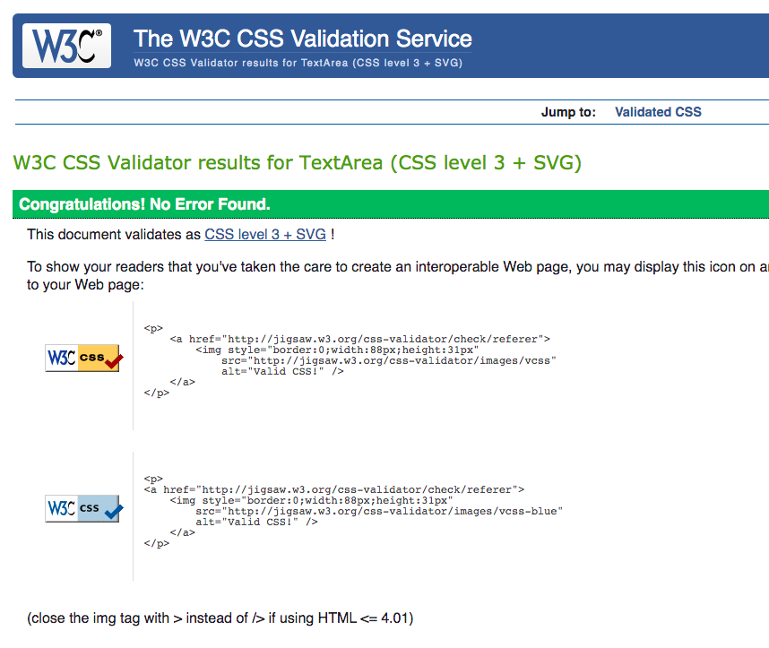
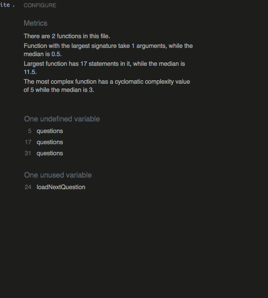

# World Cup Quiz
## Overview
This site is for the ultimate soccer fan, it will have a simple layout asking 5 questions related to the FIFA World Cup. A place where soccer fan can test their knowledge.
## Table of Contents
> - [Overview](#overview)
> - [Description](#description)
> - [Wireframes](#wireframes)
> - [Strategy](#strategy)
> - [ User Stories](#user-stories)
> - [Structure](#structure)
> - [Surface](#surface)
> - [Features](#features)
> - [Technologies Used](#technologies-used)
> - [Testing](#testing)
> - [Credits](#credits)

## Description
Simple and easy quiz layout for soccer fans. The layout will be clear clean and responsive to the users, moving through the questions and providing their final score to see how well they did in the quiz.

## Wireframes
* [Desktop](https://github.com/Colin-K88/world-cup-quiz/blob/master/assets/wireframes/desktop.png)
* [Ipad](https://github.com/Colin-K88/world-cup-quiz/blob/master/assets/wireframes/Ipad.png)
* [Mobile](https://github.com/Colin-K88/world-cup-quiz/blob/master/assets/wireframes/mobile.png)
## UX
### Strategy
This website is to give a bright colourful and welcoming feel for all users of all demographics. With 5 questions ranging in diffiucty for all users to give them a challenge.
#### Bussiness Goals
* To provide a fun interactive quiz for all demographics.
### User Stories
#### New Users
* As a new user, I would like to have a clearly labeled and easily accessible way to to work through the quiz.
* As a new user, I would like the quiz to give me my final score so I know how well I did.

#### Returning User
* As a returning user, I would like the site to stay consistent in regards layout. 
## Structure
This is a simple site designed for an easy smooth experiance. It will have soccer themed images and colours 
as well as a layout that is easy on the eye and fun for all demographics
## Surface
#### Images
All images on the website were intended to be bright and colorful to make the product look as attractive as possible, also to provide the soccer theme and feel throughout.
#### Colurs
The primary color used is #337917 and this is to complement the background of green grass and is always used on top of feature colors such as white or rgba(255, 255, 255, 0.5); to give clean contrast.
#### Typography
This website uses Righteous font to give a clean stylish look to main font of the site

## Features
#### Home Page
* This will be the first page the user sees, it will give a brief description of the quiz and a "Play" button to bring the user to the start of the quiz.
 
 #### Quiz Page
 * This page will provide the question and answers, giving the user 4 answers to choose from and a submit button that will bring them to the next question.

 #### Result Page
 * When the user submits the final question it will bring them to this page and give them the score from their quiz.

## Technologies Used

### Lnaguages
* [HTML](https://en.wikipedia.org/wiki/HTML)
* [CSS](https://en.wikipedia.org/wiki/CSS)
### Framworks, Libararies & Tools
* [GitHub](http://github.com)
* [Balsamiq](http://balsamiq.com)
* [Unsplash](https://unsplash.com/)
* [FontAwesome](https://fontawesome.com/)
* [GitPod](https://www.gitpod.io/)
* [favicon](https://https://favicon.io/) 
* [Google Fonts](https://fonts.google.com/)
* [YouTube](https://www.youtube.com/)

## Testing 
### Lighthouse Testing 
* Home Page: Desktop

* Quiz/Result Page: Mobile

### Validation Testing 
#### HTML / [W3C](https://validator.w3.org/)

#### CSS / [W3C](https://jigsaw.w3.org/css-validator/)
* No issues reported

#### Java / [JSHint](https://https://jshint.com/)

## User Story Testing
### New Users
" As a new user, I would like to have a clearly labeled and easily accessible way to to work through the quiz."
> * The first thing a new user will see is a clean clear layout and a short and simple explanation to the quiz, followed by a 'Play'. Once the quiz starts they will see the same background as the home page for consistency keeping everything clear and easy.

" As a new user, I would like the quiz to give me my final score so I know how well I did."
> * When the user gets to the final question the submit button changes to a 'finish' button and once clicked the user will be provided with their score.

### Returning Users
"As a returning user, I would like the site to stay consistent in regards layout."
> * This is done by making the site respnsive across all screen sizes to avoid any major layout changes.
## Deployment 
* Once my github acoount was set up, I went to the avatar menu at the top right hand side of github and selected
"your repositories" then clicking the green button "New" to set up a new repository.
* I used the Code Institute template for the repository.
* I then clicked the green "gitpod" button. Gitpod was used to write the code and was then pushed or saved to github.
* I aslo went to the repository in github and went to "Settings" where I scrolled down to "GitHub Pages" and selected "Master Branch"
  under the source header.
* This then provided me with the site URL once pushed to github pages.
 
 ### Run Project
* If you wish to clone this repository please follow these steps [here!](https://docs.github.com/en/github/creating-cloning-and-archiving-repositories/cloning-a-repository)
* If you wish to fork this repository please follow these steps [here!](https://docs.github.com/en/github/getting-started-with-github/fork-a-repo)
* At the top of this repositoryyou can also click the green "Code" button and download the zip.

## Credits

### Content
### Code Snippets
* Java code was used and edited from this link to suit simplistic need of site (https://www.youtube.com/watch?v=EcucHCNPT1Y&t=581s)
## Images
#### Home page
* Background Image: (https://www.pexels.com/photo/green-grass-186230/)
* Favicon: (https://favicon.io/emoji-favicons/soccer-ball)
## Acknowledgments 
* I would like to give a huge thanks to my mentor Nishant Kumar for his guidance and resources.
* I would like to thank the slack community for sharing their problems and solutions as well as Tutor Support. 